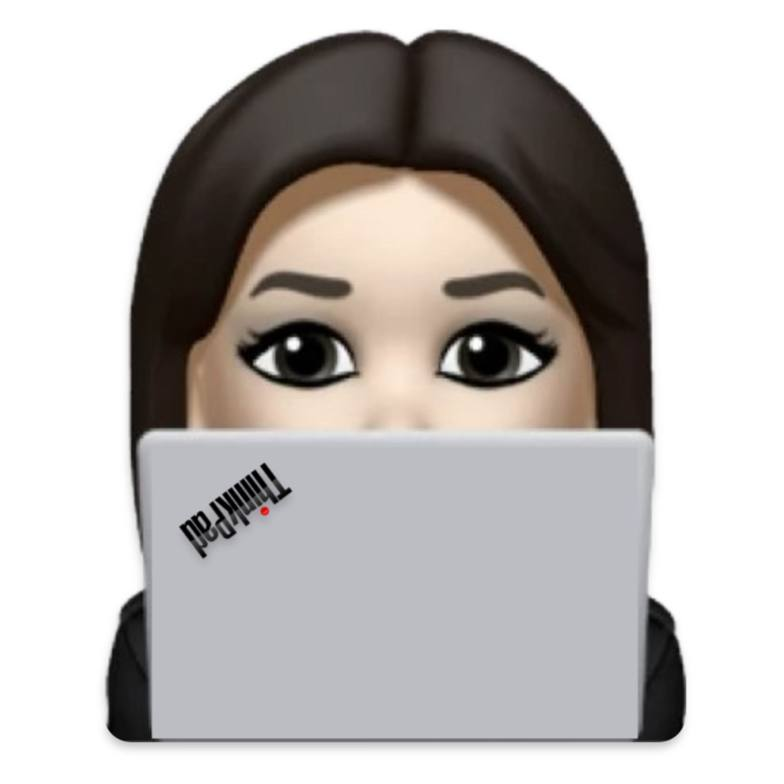

<div class="body center" align="center">

# Hi 👋 it's Reds

<p align="center">
  <a href="https://github.com/redscorpse">
    
  </a>
</p>


### About Me (with emojis)

```python
TECH:    ["🍏", "🐧", "🦭", "🐍", "🐉"]
HOBBIES: ["👩🏻‍💻", "📖", "✒️", "🃏", "🎵"]
```

### Programming languages I use


<!-- 
### My contributions


Generated with *[Platane/snk](https://github.com/Platane/snk)* 

<p>
  
</p>
-->

### Follow along
| <a href="https://redscorpse.sytes.net/"></a> |
|:--------------------------------------------------------------------------------------------------------------: |
|                                **[redscorpse.sytes.net](https://redscorpse.sytes.net)**                         |
| <a href="https://twitter.com/redsc0rpse"></a> <a href="https://github.com/redscorpse"></a> <a href="https://www.linkedin.com/in/ana-rojas/"></a> |


</div>

<!--### Hi there 👋


**redscorpse/redscorpse** is a ✨ _special_ ✨ repository because its `README.md` (this file) appears on your GitHub profile.

Here are some ideas to get you started:

- 🔭 I’m currently working on ...
- 🌱 I’m currently learning ...
- 👯 I’m looking to collaborate on ...
- 🤔 I’m looking for help with ...
- 💬 Ask me about ...
- 📫 How to reach me: ...
- 😄 Pronouns: ...
- ⚡ Fun fact: ...
-->
